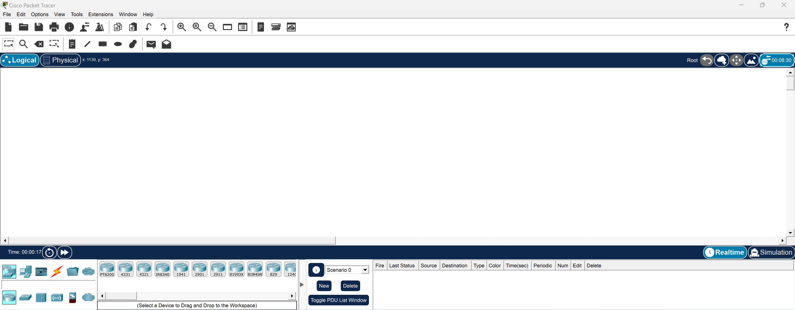

**Lingua:** [🇮🇹 Italiano](README.it.md) | [🇬🇧 English](README.md)

---

# Cisco Packet Tracer – Manuale Tecnico di Laboratorio

Manuale operativo per l'uso di **Cisco Packet Tracer** finalizzato allo studio delle reti e allo svolgimento di esercitazioni pratiche in laboratorio.

Il documento ha un taglio **procedurale**, orientato alla pratica e pensato per essere consultato rapidamente durante le attività di configurazione e troubleshooting.

---

## Installazione

1. **Registrazione**: creare un account gratuito su Cisco Networking Academy

   [https://www.netacad.com/cisco-packet-tracer](https://www.netacad.com/cisco-packet-tracer)

2. **Download**: scaricare la versione più recente per il proprio sistema operativo

   [https://www.netacad.com/about-networking-academy/packet-tracer](https://www.netacad.com/about-networking-academy/packet-tracer)

3. **Installazione e avvio**: seguire la procedura guidata e accedere con le credenziali Cisco

---

## Struttura del Manuale

### 📘 Guida CLI
Riferimento rapido per i comandi essenziali della Command Line Interface (CLI) di Cisco IOS:
- **[Guida CLI in Italiano](./cli/cli.it.md)**

### 📙 Teoria di riferimento
Concetti base e approfondimenti:
- **[Struttura IPv4, maschere e CIDR](./theory/ipv4-mask.it.md)** — indirizzi IPv4, rete/broadcast, subnetting e supernetting
- **[Reti private e NAT](./theory/reti-private.it.md)** — intervalli RFC 1918, NAT e APIPA

### 🔬 Scenari di Laboratorio

Gli scenari sono organizzati in ordine di **complessità crescente**, partendo da configurazioni semplici fino ad architetture multi-router.

#### [Scenario 1 – Singola rete LAN](./scenario/scenario1.it.md)
Configurazione di una rete LAN semplice con uno switch e tre PC. Ideale per comprendere i concetti di indirizzamento IP di base e connettività layer 2.

#### [Scenario 2 – Due reti LAN collegate da router (Forwarding)](./scenario/scenario2.it.md)
Configurazione di due reti LAN separate collegate tramite un router. Introduce i concetti di gateway, routing tra reti e forwarding dei pacchetti.

#### [Scenario 3 – Tre reti LAN PRIVATE con routing statico (Ring)](./scenario/scenario3.it.md)
Architettura avanzata con tre router collegati ad anello. Introduce i protocolli di routing statico e la ridondanza dei percorsi.