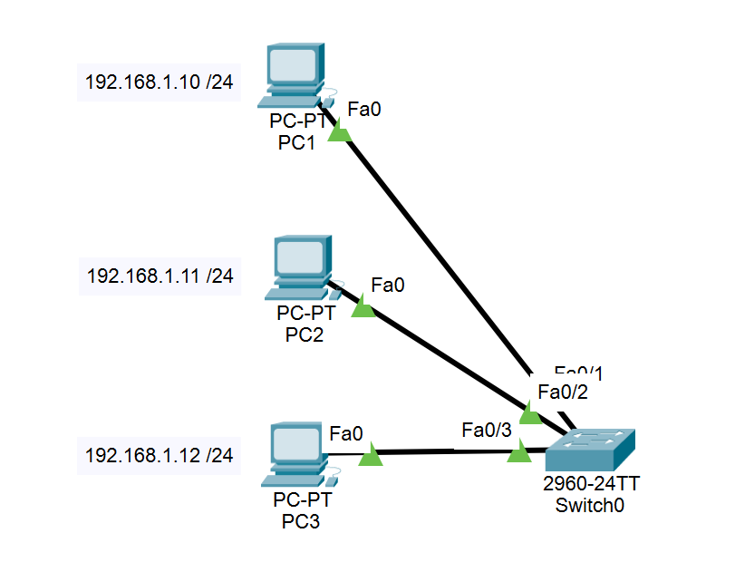
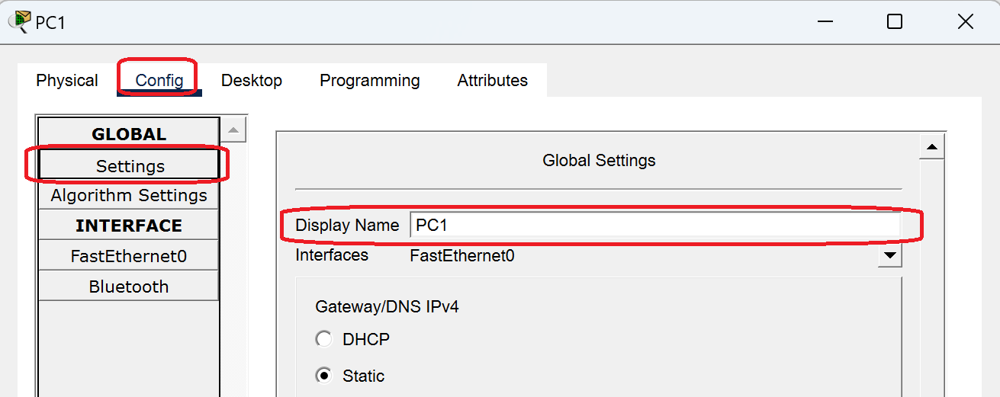
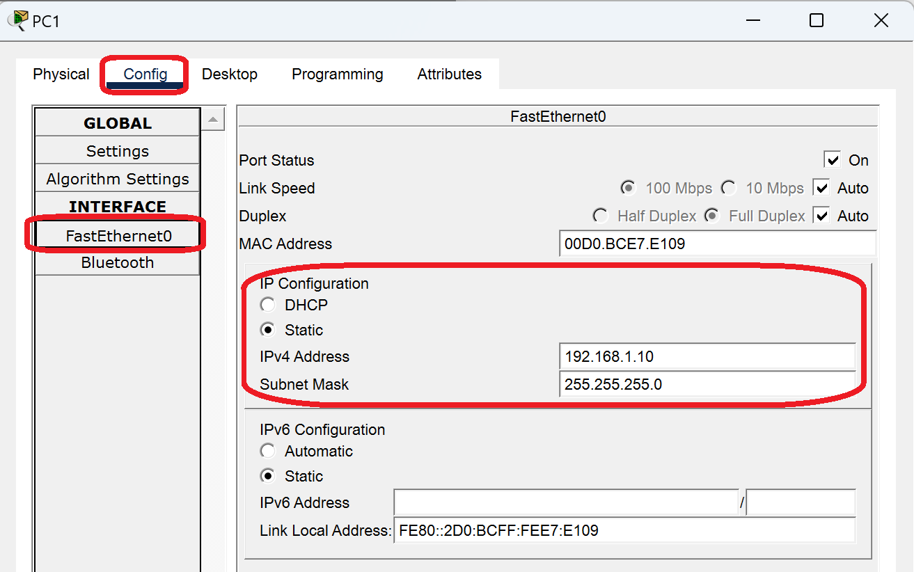

**Language:** [English](scenario1.md) | [Italiano](scenario1.it.md)

**Home:** [README.md](../README.md)

## Scenario 1 – Single LAN

### Topology

- 1 Layer 2 Switch (**example: model 2960**)
- 3 hosts (PC) connected to the switch via **Copper Straight-Through** cables

### IP Addressing

| Device | IP Address    | Subnet Mask   |
|--------|---------------|---------------|
| PC1    | 192.168.1.10  | 255.255.255.0 |
| PC2    | 192.168.1.11  | 255.255.255.0 |
| PC3    | 192.168.1.12  | 255.255.255.0 |

---
### Configuration (example on PC1)

> Note: the switch does not require IP configuration for basic operation in a simple LAN.

1. **Change the device name**: customize the PC name to identify it easily in the topology.
   
   Path: `Config` → `Global` → `Settings`

2. **Configure the IP address and subnet mask**: assign the static IP address to the network interface.
   
   Path: `Config` → `Interface` → `FastEthernet0`

3. **Repeat the configuration** for the other two hosts PC2 and PC3, using the IP addresses from the table above.

### Verification

- Use the **ping** command from one PC to the others (example: `ping 192.168.1.11`)
- Communication should succeed with no packet loss (0% packet loss)
- Verify that all three PCs can communicate with each other

---

### Theory References

- Netmask, CIDR and network/broadcast calculation: [theory/ipv4-mask.md](../theory/ipv4-mask.md)
- Private IPv4 ranges (RFC 1918): [theory/reti-private.md](../theory/reti-private.md)
- Cisco IOS CLI commands guide: [cli/cli.md](../cli/cli.md)

---

Back to home: [README.md](../README.md)
