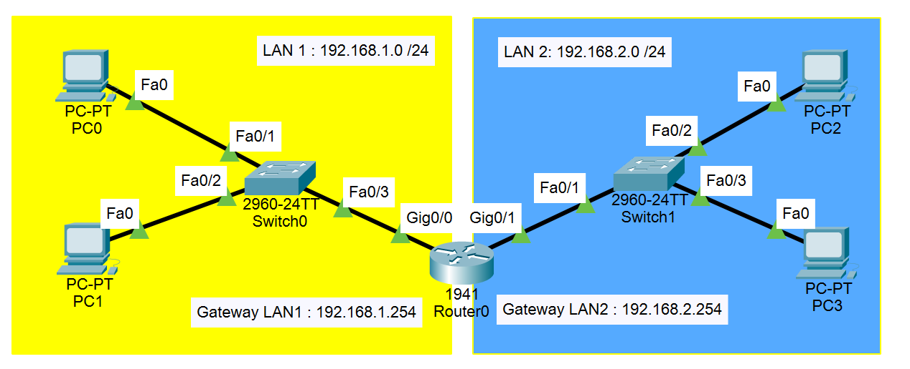
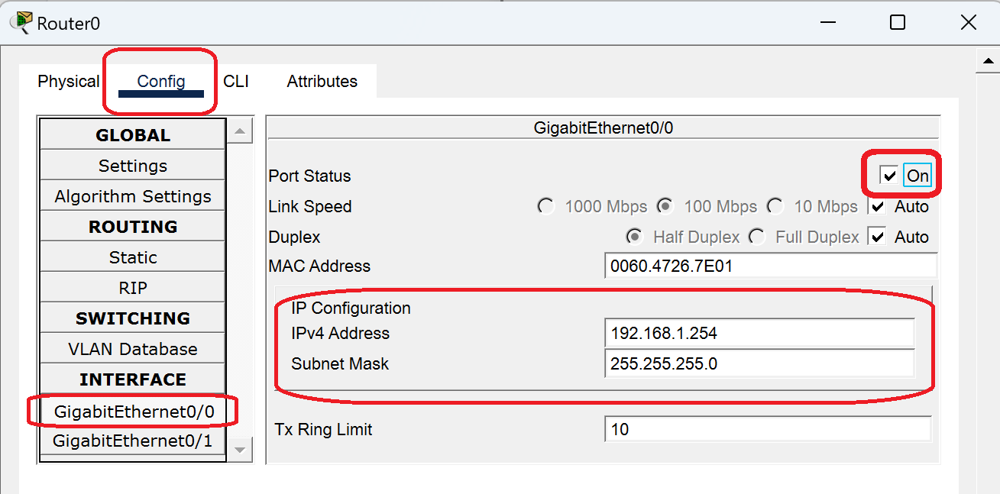
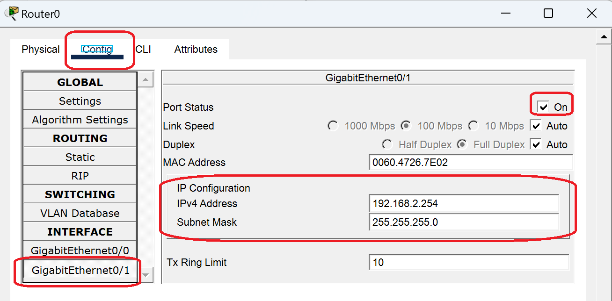
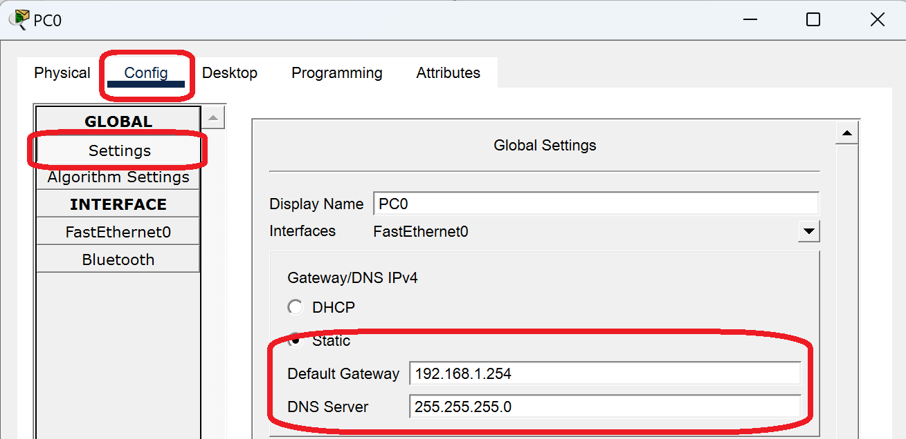
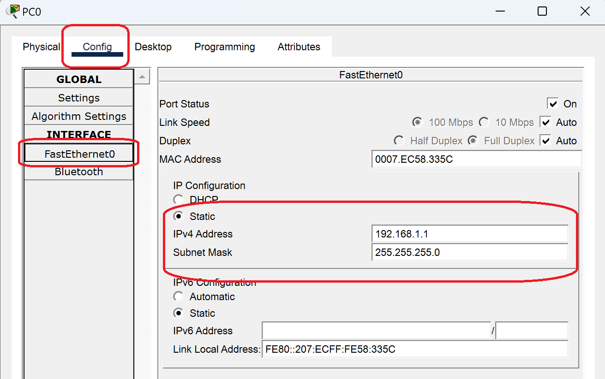

**Lingua:** [🇮🇹 Italiano](scenario2.it.md) | [🇬🇧 English](scenario2.md)

**Home:** [README.it.md](../README.it.md)

## Scenario 2 – Due reti LAN collegate da router (Forwarding)

### Topologia

- 1 router (**esempio: modello 1941**)
- 2 switch (**esempio: modello 2960**)
- 2 LAN distinte (ciascuna collegata a un'interfaccia del router)

### Indirizzamento IP

**LAN 1**
- Rete: 192.168.1.0/24  
- Gateway: 192.168.1.254  

**LAN 2**
- Rete: 192.168.2.0/24 
- Gateway: 192.168.2.254 



### Configurazione tramite GUI

1. **Preparare il piano di indirizzamento**: pianificare in anticipo tutti gli indirizzi IP, gateway e subnet mask. Il lavoro su Cisco Packet Tracer deve ridursi a puro data-entry.

2. **Configurare le interfacce del router**: assegnare a ciascuna interfaccia del router l'indirizzo IP del gateway della rispettiva LAN.
   - Per la LAN 1: assegnare 192.168.1.254 all'interfaccia GigabitEthernet0/0
   - Per la LAN 2: assegnare 192.168.2.254 all'interfaccia GigabitEthernet0/1
   - Ricordarsi di attivare le interfacce (pulsante "On")




3. **Configurare il gateway predefinito su ciascun PC**: specificare l'indirizzo IP del router per permettere la comunicazione tra le due LAN.
   
   Percorso: `Config` → `Global` → `Settings`



4. **Configurare l'indirizzo IP della scheda di rete su ciascun PC**: assegnare un indirizzo IP univoco all'interno della propria rete.
   
   Percorso: `Interface` → `FastEthernet0`



### Troubleshooting

* **Routing table non aggiornata**: provare a inviare 3 volte una PDU (Simple PDU) per aggiornare la routing table. La prima comunicazione potrebbe fallire finché il router non apprende i percorsi necessari.
* **Etichette delle porte non visibili**: verificare la visualizzazione delle interfacce tramite `Options` → `Preferences` → `Interface` → selezionare "Always Show Port Labels in Logical Workspace".
* **Interfacce disabilitate**: assicurarsi che tutte le interfacce del router siano attivate (stato "On"). Le interfacce spente sono una causa comune di mancata connettività.

### Configurazione tramite CLI del router (esempio)

```text
Router> enable
Router# configure terminal
Router(config)# interface g0/0
Router(config-if)# ip address 192.168.1.254 255.255.255.0
Router(config-if)# no shutdown
Router(config-if)# exit

Router(config)# interface g0/1
Router(config-if)# ip address 192.168.2.254 255.255.255.0
Router(config-if)# no shutdown
Router(config-if)# exit

Router(config)# exit
Router# write memory
```

**Spiegazione dei comandi:**
- `enable`: accesso alla modalità privilegiata
- `configure terminal`: accesso alla modalità di configurazione globale
- `interface g0/0` (o `g0/1`): selezione dell'interfaccia da configurare
- `ip address [IP] [MASCHERA]`: assegnazione dell'indirizzo IP e subnet mask all'interfaccia
- `no shutdown`: attivazione dell'interfaccia (di default le interfacce sono spente)
- `exit`: uscita dal livello di configurazione corrente
- `write memory`: salvataggio della configurazione nella memoria permanente (NVRAM)

---

### Riferimenti teorici

- Indirizzamento IPv4, maschere e CIDR (/24): [theory/ipv4-mask.it.md](theory/ipv4-mask.it.md)
- Reti IPv4 private (RFC 1918): [theory/reti-private.it.md](theory/reti-private.it.md)
- Guida comandi CLI Cisco IOS: [cli/cli.it.md](cli/cli.it.md)

---

Torna alla home: [README.it.md](../README.it.md)