**Lingua:** [🇮🇹 Italiano](scenario3.it.md) | [🇬🇧 English](scenario3.md)

**Home:** [README.it.md](../README.it.md)

## Scenario 3 – Tre reti LAN PRIVATE con router collegati ad anello (Routing Statico)

### Topologia

Lo scenario prevede un'architettura **multi-router** con ridondanza dei percorsi:

- **3 router** (esempio: modello 1941)
- **3 switch** (esempio: modello 2960)
- **3 reti LAN PRIVATE (RFC 1918) distinte** (una per ogni router)
- Ogni LAN è collegata a uno switch, a sua volta connesso a un'interfaccia del router
- I router sono interconnessi tramite **link punto-punto** seriali (3 reti /30)
- **Topologia ad anello (ring)**: ogni router è collegato ad altri due, garantendo ridondanza

Questa configurazione permette di avere percorsi alternativi in caso di guasto di un link.

---

### Piano di Indirizzamento IP

#### Reti LAN PRIVATE (accesso utenti) RFC 1918

| LAN   | Router | LAN Network      | Gateway         | Range Hosts        |
|-------|--------|------------------|-----------------|--------------------|
| LAN 0 | R0     |     10.0.0.0/8   | 10.255.255.254  | 10.0.0.1 – 10.255.255.254 |
| LAN 1 | R1     |  172.16.0.0/12   | 172.31.255.254  | 172.16.0.1 – 172.31.255.254 |
| LAN 2 | R2     | 192.168.0.0/16   | 192.168.255.254 | 192.168.0.1 – 192.168.255.254 |

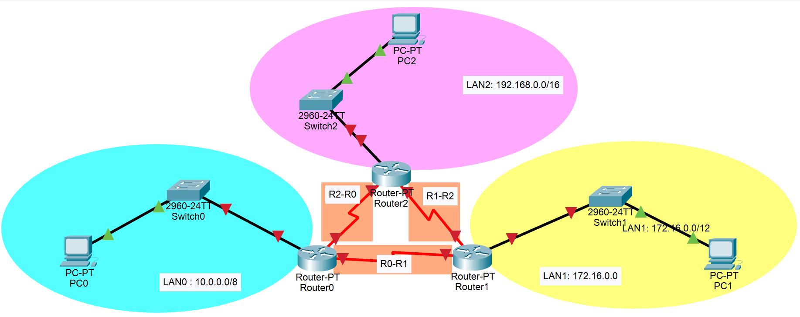

#### Collegamenti WAN tra router (punto-punto)

Subnet **/30** per i link seriali (2 host utilizzabili per link).

| Collegamento | Rete /30      | IP Interfaccia A  | IP Interfaccia B  | Interfacce         |
|--------------|---------------|-------------------|-------------------|--------------------|
| R0 ↔ R1      | 200.0.0.0/30  | 200.0.0.1 (R0)    | 200.0.0.2 (R1)    | R0: s3/0, R1: s3/0 |
| R1 ↔ R2      | 200.0.0.4/30  | 200.0.0.5 (R1)    | 200.0.0.6 (R2)    | R1: s2/0, R2: s3/0 |
| R2 ↔ R0      | 200.0.0.8/30  | 200.0.0.9 (R2)    | 200.0.0.10 (R0)   | R2: s2/0, R0: s2/0 |

>Scrivere su carta il disegno

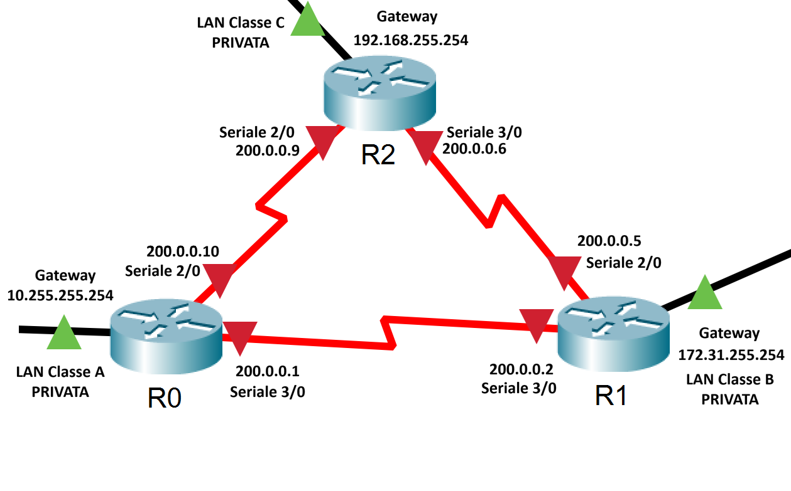

---

### Configurazione tramite GUI

#### 1. Preparare il piano di indirizzamento completo (sulla carta/block notes)

Prima di iniziare, documentare:
- Indirizzi IP di tutte le interfacce LAN (interfacce host/ default gateway)
- Indirizzi IP di tutti i link WAN (interfacce router)
- Tabelle di routing statico per ogni router

#### 2. Configurare le interfacce LAN di ciascun router

Per ogni router, configurare l'indirizzo del dafault gateway all'interfaccia FastEthernet collegata allo switch della LAN locale:

Percorso: `Config` → `Interface` → `FastEthernet0/0`

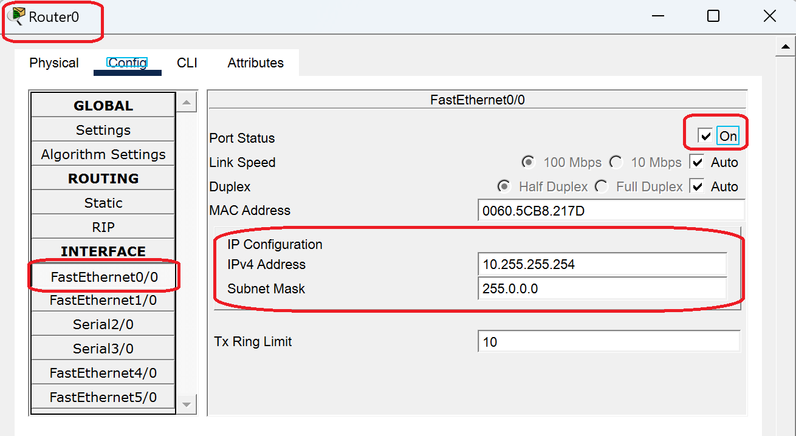
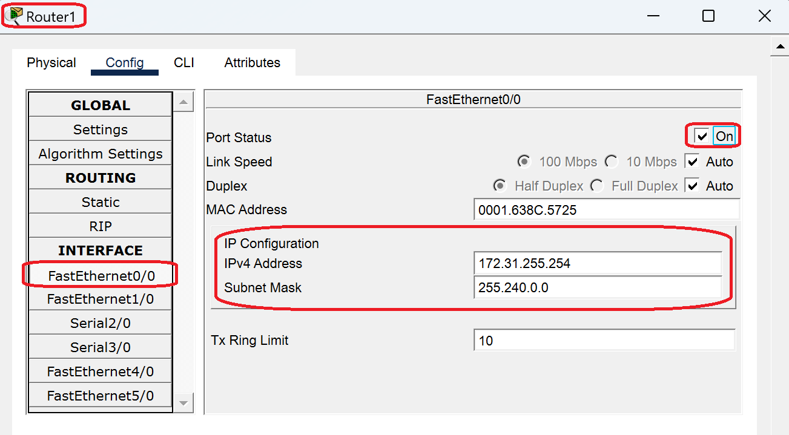
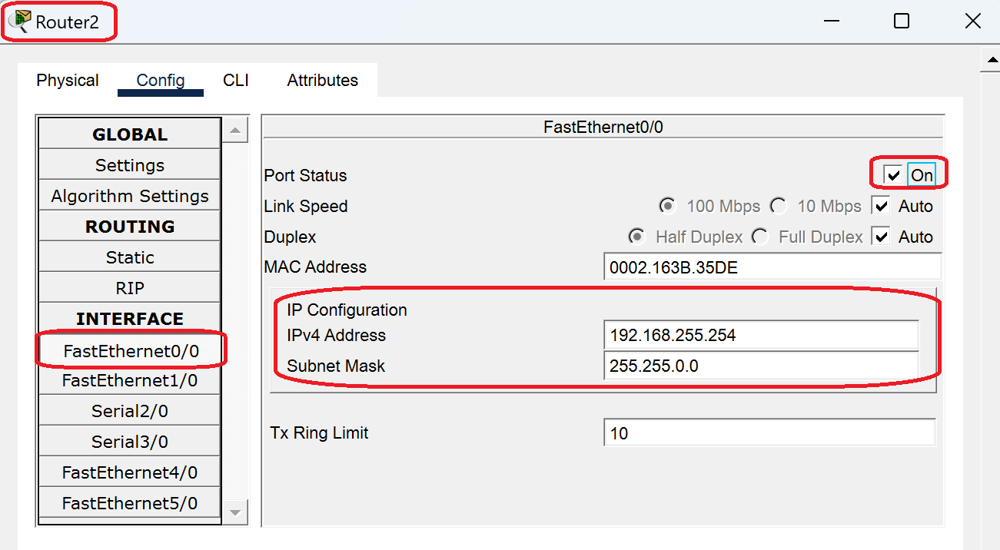

#### 3. Configurare le interfacce WAN seriali

Per ogni link punto-punto, configurare entrambe le interfacce seriali dei router collegati:

Percorso: `Config` → `Interface` → `Serial0/0/0` (o `Serial0/0/1`)

> **Nota importante**: Per i link seriali, uno dei due router deve essere configurato come **DCE** (Data Communications Equipment) e deve impostare il **clock rate**. Solitamente si imposta 64000 bps per i laboratori.

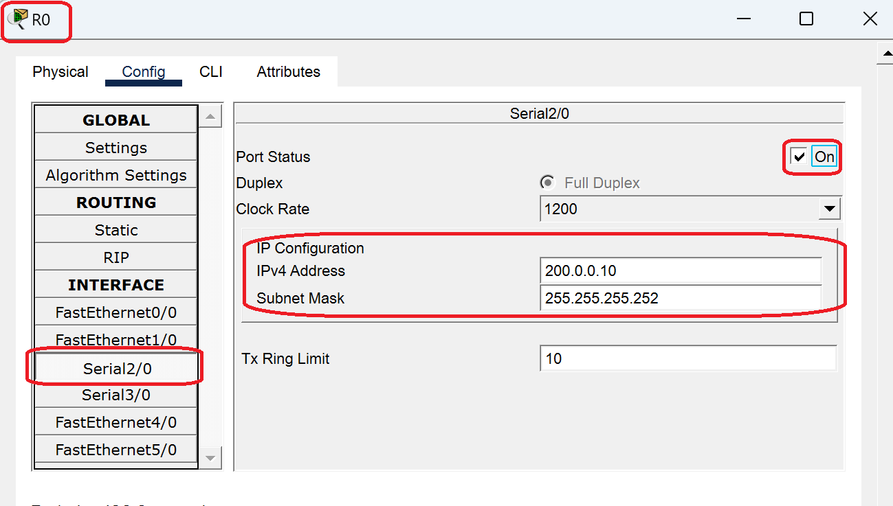
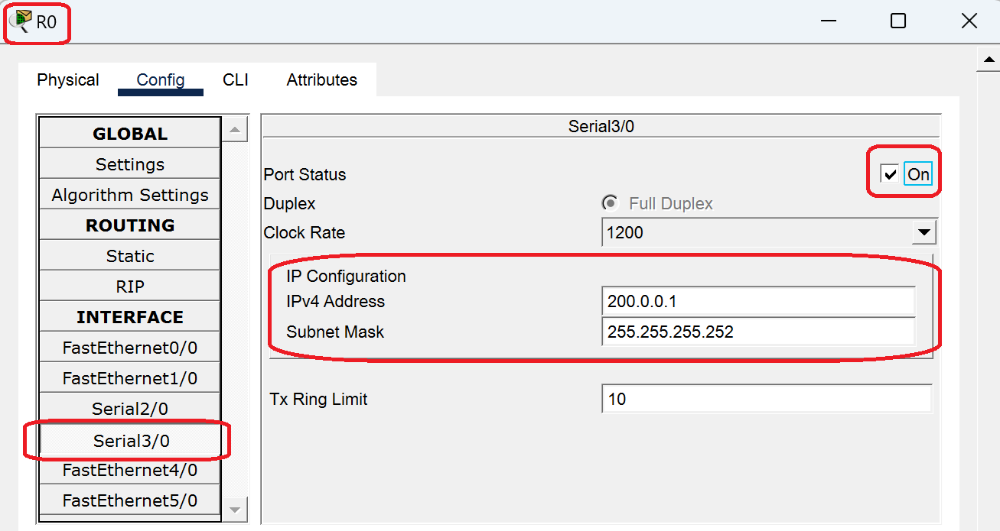
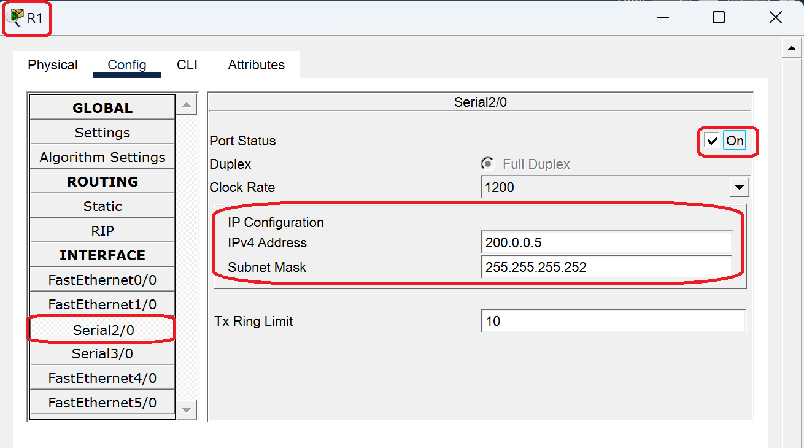
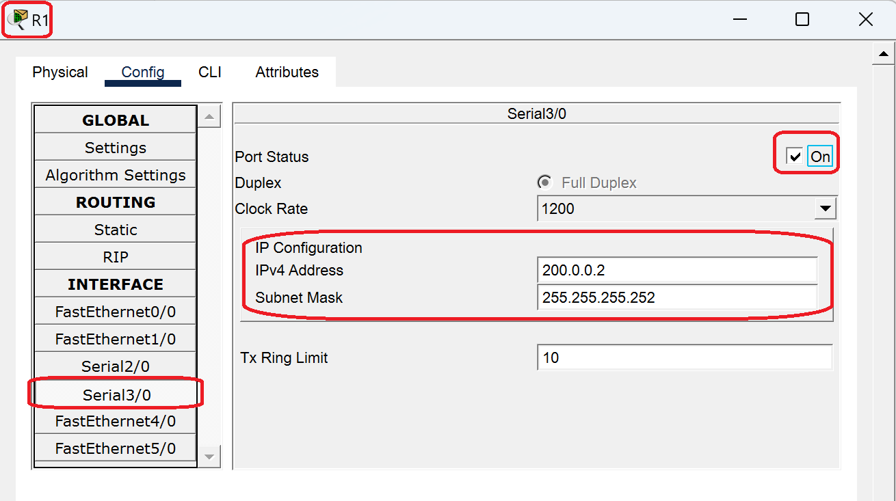
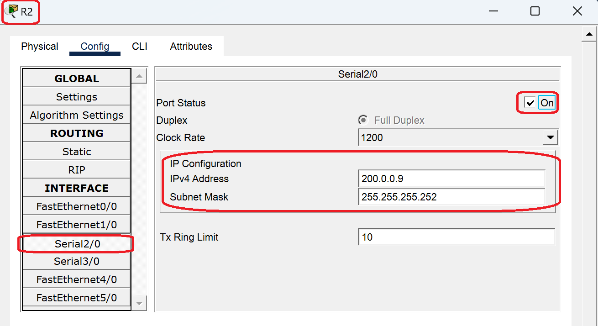
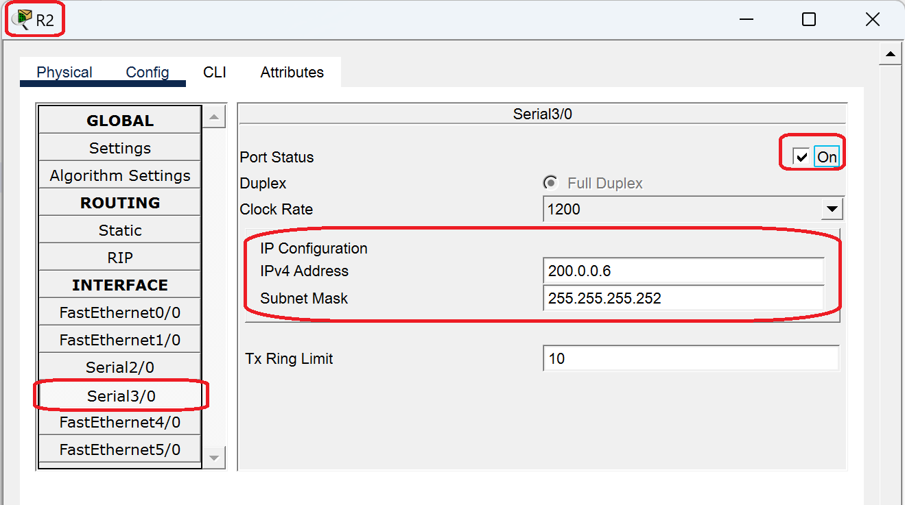

#### 4. Configurare il gateway predefinito sui PC

Su ciascun PC, impostare come gateway l'indirizzo IP del router della propria LAN:

Percorso: `Config` → `Global` → `Settings`

> Vedi scenario 2

#### 5. Configurare gli indirizzi IP dei PC

Assegnare a ciascun PC un indirizzo IP della propria rete LAN:

Percorso: `Interface` → `FastEthernet0`

> Vedi scenario 1 e 2

#### 6. Configurare il routing statico

**Fondamentale**: I router devono conoscere le rotte verso le reti remote. Utilizzare la sezione CLI più avanti per configurare le rotte statiche su ciascun router.
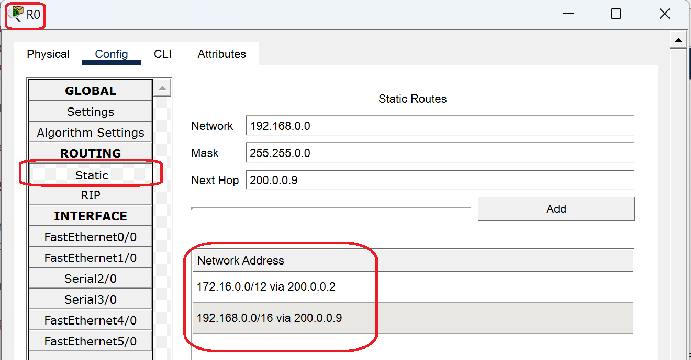
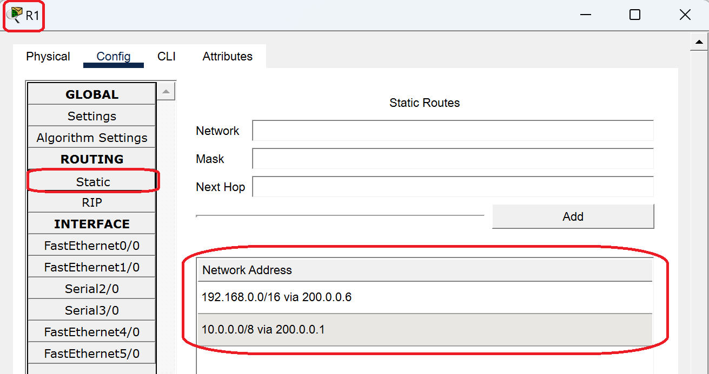
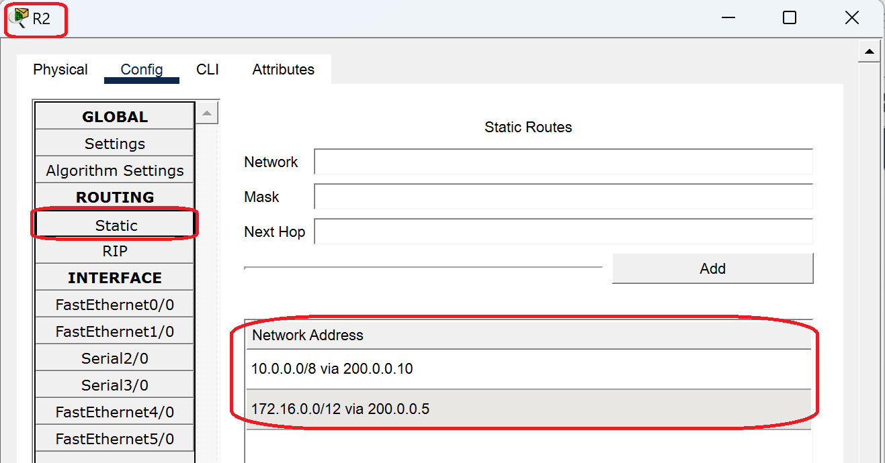
---

### Configurazione tramite CLI

#### Configurazione completa Router 1 (R1)

```text
Router> enable
Router# configure terminal
Router(config)# hostname R1

! Configurazione interfaccia LAN
R1(config)# interface FastEthernet0/0
R1(config-if)# ip address 172.31.255.254 255.240.0.0
R1(config-if)# description LAN 1
R1(config-if)# no shutdown
R1(config-if)# exit

! Configurazione link R1–R0 (interfaccia seriale DCE)
R1(config)# interface Serial3/0
R1(config-if)# ip address 200.0.0.2 255.255.255.252
R1(config-if)# description Link to R0
R1(config-if)# clock rate 64000
R1(config-if)# no shutdown
R1(config-if)# exit

! Configurazione link R1–R2 (interfaccia seriale DTE)
R1(config)# interface Serial2/0
R1(config-if)# ip address 200.0.0.5 255.255.255.252
R1(config-if)# description Link to R2
R1(config-if)# no shutdown
R1(config-if)# exit

! Configurazione rotte statiche verso reti remote
! Rotta verso LAN 0 (via R0)
R1(config)# ip route 10.0.0.0 255.0.0.0 200.0.0.1
! Rotta verso LAN 2 (via R2)
R1(config)# ip route 192.168.0.0 255.255.0.0 200.0.0.6
! Rotta verso link R2-R0 (via R2)
R1(config)# ip route 200.0.0.8 255.255.255.252 200.0.0.6

! Salvataggio configurazione
R1(config)# exit
R1# write memory
```

#### Configurazione completa Router 2 (R2)

```text
Router> enable
Router# configure terminal
Router(config)# hostname R2

! Configurazione interfaccia LAN
R2(config)# interface FastEthernet0/0
R2(config-if)# ip address 192.168.255.254 255.255.0.0
R2(config-if)# description LAN 2
R2(config-if)# no shutdown
R2(config-if)# exit

! Configurazione link R2–R1 (interfaccia seriale DCE)
R2(config)# interface Serial3/0
R2(config-if)# ip address 200.0.0.6 255.255.255.252
R2(config-if)# description Link to R1
R2(config-if)# clock rate 64000
R2(config-if)# no shutdown
R2(config-if)# exit

! Configurazione link R2–R0 (interfaccia seriale DTE)
R2(config)# interface Serial2/0
R2(config-if)# ip address 200.0.0.9 255.255.255.252
R2(config-if)# description Link to R0
R2(config-if)# no shutdown
R2(config-if)# exit

! Configurazione rotte statiche verso reti remote
! Rotta verso LAN 1 (via R1)
R2(config)# ip route 172.16.0.0 255.240.0.0 200.0.0.5
! Rotta verso LAN 0 (via R0)
R2(config)# ip route 10.0.0.0 255.0.0.0 200.0.0.10
! Rotta verso link R0-R1 (via R0)
R2(config)# ip route 200.0.0.0 255.255.255.252 200.0.0.10

! Salvataggio configurazione
R2(config)# exit
R2# write memory
```

#### Configurazione completa Router 0 (R0)

```text
Router> enable
Router# configure terminal
Router(config)# hostname R0

! Configurazione interfaccia LAN
R0(config)# interface FastEthernet0/0
R0(config-if)# ip address 10.255.255.254 255.0.0.0
R0(config-if)# description LAN 0
R0(config-if)# no shutdown
R0(config-if)# exit

! Configurazione link R0–R1 (interfaccia seriale DTE)
R0(config)# interface Serial3/0
R0(config-if)# ip address 200.0.0.1 255.255.255.252
R0(config-if)# description Link to R1
R0(config-if)# no shutdown
R0(config-if)# exit

! Configurazione link R0–R2 (interfaccia seriale DCE)
R0(config)# interface Serial2/0
R0(config-if)# ip address 200.0.0.10 255.255.255.252
R0(config-if)# description Link to R2
R0(config-if)# clock rate 64000
R0(config-if)# no shutdown
R0(config-if)# exit

! Configurazione rotte statiche verso reti remote
! Rotta verso LAN 1 (via R1)
R0(config)# ip route 172.16.0.0 255.240.0.0 200.0.0.2
! Rotta verso LAN 2 (via R2)
R0(config)# ip route 192.168.0.0 255.255.0.0 200.0.0.9
! Rotta verso link R1-R2 (via R1)
R0(config)# ip route 200.0.0.4 255.255.255.252 200.0.0.2

! Salvataggio configurazione
R0(config)# exit
R0# write memory
```

---

### Verifica della Configurazione

#### 1. Verificare lo stato delle interfacce

Su ciascun router, controllare che tutte le interfacce siano attive:

```text
R1# show ip interface brief
```

Output atteso: tutte le interfacce configurate devono mostrare **Status: up** e **Protocol: up**.

#### 2. Verificare la tabella di routing

Su ciascun router, visualizzare la tabella di routing:

```text
R1# show ip route
```

Verificare la presenza di:
- Rotte **C** (Connected): reti direttamente collegate
- Rotte **S** (Static): rotte statiche configurate manualmente

#### 3. Test di connettività base

Dal prompt dei comandi di un PC, testare:

```text
# Ping al gateway locale (esempio da LAN 0)
ping 10.255.255.254

# Ping a un PC di un'altra LAN (esempio da LAN 0 a LAN 1)
ping 172.16.0.10

# Ping all'interfaccia di un router remoto
ping 200.0.0.2
```

#### 4. Tracciamento del percorso

Per visualizzare il percorso seguito dai pacchetti:

```text
tracert 192.168.0.10
```

Questo comando mostra tutti gli hop (router) attraversati dal pacchetto.

---

### Troubleshooting

#### Problema: PC non riesce a pingare un PC in un'altra LAN

**Possibili cause:**

1. **Gateway non configurato sul PC**: verificare che ogni PC abbia impostato il gateway corretto
2. **Rotte statiche mancanti o errate**: verificare con `show ip route` che ogni router conosca tutte le reti
3. **Interfacce spente**: verificare con `show ip interface brief` che tutte le interfacce siano "up"
4. **Clock rate non configurato**: su link seriali, almeno un'estremità deve essere DCE con clock rate impostato

#### Problema: Il primo ping fallisce, poi funziona

**Causa**: Normale. Il primo pacchetto serve per popolare le tabelle ARP. I pacchetti successivi avranno successo.

#### Problema: Interfaccia seriale rimane "down/down"

**Possibili soluzioni:**

1. Verificare che il cavo seriale sia del tipo corretto (DCE o DTE)
2. Verificare che il clock rate sia configurato sul lato DCE
3. Controllare che entrambe le estremità abbiano il comando `no shutdown`
4. In Packet Tracer: verificare che entrambi i router siano accesi

#### Problema: Routing non funziona in caso di guasto di un link

**Causa**: Con routing statico, se un link cade, le rotte non si aggiornano automaticamente. Per avere failover automatico, è necessario implementare routing dinamico (RIP, EIGRP, OSPF) o configurare rotte statiche con metrica floating.

---

### Approfondimenti: Routing Statico

#### Cos'è il Routing Statico?

Il **routing statico** consiste nel configurare manualmente su ogni router le rotte verso le reti non direttamente collegate. Ogni rotta statica specifica:

- **Rete di destinazione**: l'indirizzo di rete remota
- **Subnet mask**: la maschera della rete remota
- **Next hop**: l'indirizzo IP del router successivo verso cui inoltrare i pacchetti

#### Vantaggi

- Controllo completo sul percorso dei pacchetti
- Nessun overhead di protocolli di routing dinamico
- Adatto per reti piccole e topologie semplici
- Maggiore sicurezza (nessuno scambio di informazioni di routing)

#### Svantaggi

- Configurazione manuale richiesta per ogni router
- Nessun adattamento automatico ai cambiamenti di topologia
- Difficile da gestire in reti grandi
- In caso di guasto di un link, il traffico non viene rediretto automaticamente

#### Quando usare il Routing Statico

- Reti piccole con topologia stabile
- Collegamenti punto-punto semplici
- Rotte di default verso Internet
- Scenari di laboratorio e testing

---

### Riferimenti teorici

- Subnetting per link punto-punto (/30) e concetti di maschera CIDR: [theory/ipv4-mask.it.md](theory/ipv4-mask.it.md)
- Guida comandi CLI Cisco IOS: [cli/cli.it.md](cli/cli.it.md)

---

Torna alla home: [README.it.md](../README.it.md)